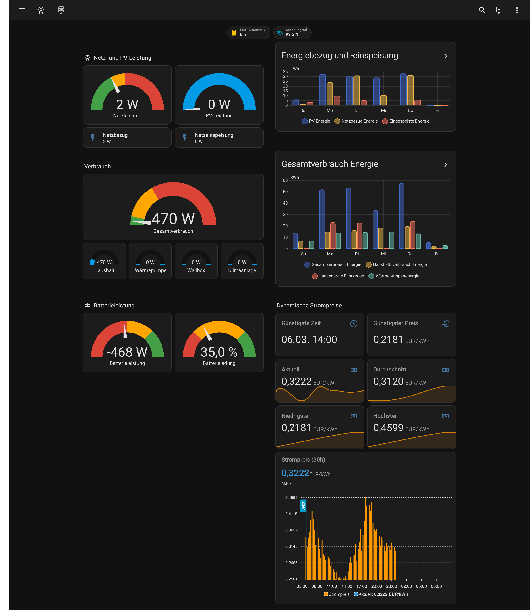
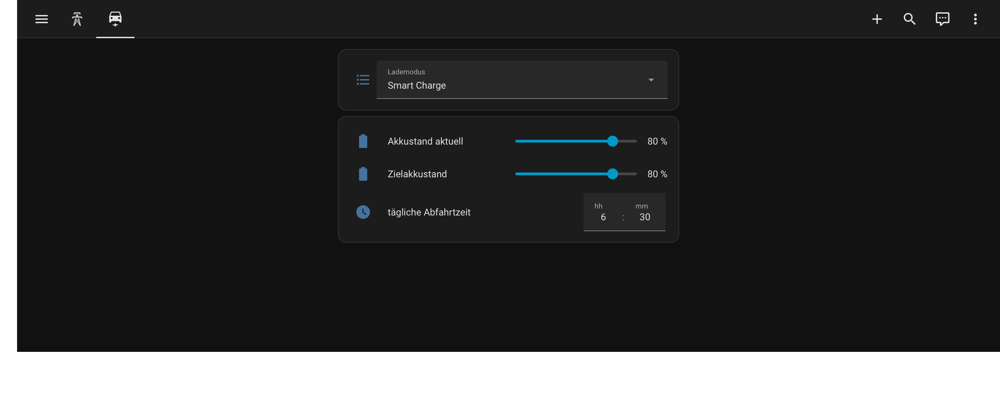

# Example Dashboard

This directory contains an example Home Assistant dashboard for the 1KOMMA5° integration. All cards use **native Home Assistant card types** — no custom frontend components required.

## Views

### Netz (Energy & Grid)



The main view is split into two columns and covers:

| Section | Cards |
|---------|-------|
| Netz- und PV-Leistung | Gauge for grid power (bidirectional, colour-coded) and PV generation; tiles for grid import and export |
| Batterieleistung | Gauge for battery charge/discharge power and state of charge |
| Verbrauch | Total consumption gauge plus individual gauges for household, heat pump, wallbox and AC |
| Energiebezug und -einspeisung | 7-day bar chart (daily delta) for PV energy, grid import and grid export |
| Gesamtverbrauch Energie | 7-day bar chart (daily delta) for total, household, EV and heat pump energy |
| Dynamische Strompreise | Cheapest future hour and price; line graphs for current, average, lowest and highest electricity price |

The view also shows two **badges** in the header: EMS auto mode switch and self-sufficiency ratio.

### EV (Electric Vehicle)



A focused view for controlling the EV charger, showing:

- Charging mode selector (Smart Charge / Quick Charge / Solar Charge)
- Manual battery level input
- Daily departure time
- Target battery level

## Usage

1. In Home Assistant go to **Settings → Dashboards → Add Dashboard** (or open an existing one in edit mode)
2. Click the ⋮ menu → **Edit Dashboard** → **Raw configuration editor**
3. Paste the content of [`dashboard.yaml`](dashboard.yaml)
4. **Adapt all entity IDs** to match your installation — replace `SYSTEM_NAME` with your own system name prefix (visible on each entity in **Settings → Devices & Services → 1KOMMA5°**)

### Template sensors for cheapest hour & price

The `cheapest_future_hour` and `cheapest_future_price` entities used in the price section are template sensors that read from the `Aktueller Strompreis` attributes. Add the following to your `configuration.yaml` (or a dedicated template file):

```yaml
template:
  - sensor:
      - name: "Cheapest future hour"
        unique_id: cheapest_future_hour
        icon: mdi:clock-outline
        availability: >
          {{ state_attr('sensor.SYSTEM_NAME_aktueller_strompreis', 'cheapest_future_hour') is not none }}
        state: >
          {{ state_attr('sensor.SYSTEM_NAME_aktueller_strompreis', 'cheapest_future_hour')
            | as_datetime | as_timestamp | timestamp_custom('%d.%m. %H:%M') }}

      - name: "Cheapest future price"
        unique_id: cheapest_future_price
        icon: mdi:currency-eur
        unit_of_measurement: EUR/kWh
        availability: >
          {{ state_attr('sensor.SYSTEM_NAME_aktueller_strompreis', 'cheapest_future_price') is not none }}
        state: >
          {{ state_attr('sensor.SYSTEM_NAME_aktueller_strompreis', 'cheapest_future_price')
            | round(4) }}
```

Replace `SYSTEM_NAME` with your system name prefix, then restart Home Assistant.
