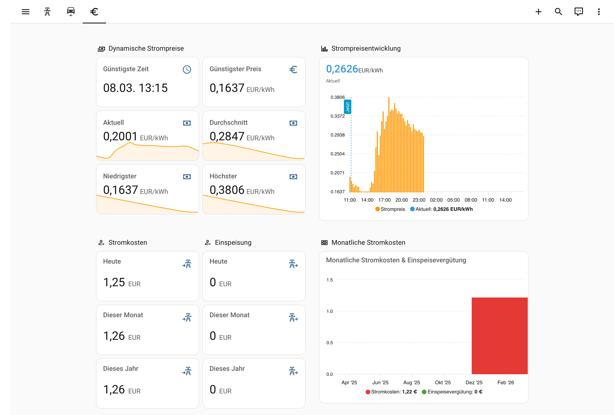

# Example Dashboard

This directory contains an example Home Assistant dashboard for the 1KOMMA5° integration. Most cards use native Home Assistant card types. The **Strompreisentwicklung**, **Monatliche Übersicht** and **Freier Zeitraum** sections additionally require the [apexcharts-card](https://github.com/RomRider/apexcharts-card) custom card (available via HACS).

## Views

### Netz (Energieverbrauch und -erzeugung)


The main view is split into two columns and covers:

| Section | Cards |
|---------|-------|
| Netz- und PV-Leistung | Gauge for grid power (bidirectional, colour-coded), PV generation, battery charge/discharge and battery state of charge |
| Verbrauch | Total consumption gauge plus individual gauges for household, heat pump, wallbox and AC |
| Energiebezug und -einspeisung | 7-day bar chart (daily delta) for PV energy, grid import and grid export; today's totals as statistic cards |
| Energieverbrauch | 7-day bar chart (daily delta) for total, household, EV and heat pump energy; today's totals as statistic cards |

The view also shows two **badges** in the header: EMS auto mode switch and self-sufficiency ratio.

### EV (Electric Vehicle)


A focused view for controlling the EV charger, showing:

- Charging mode selector (Smart Charge / Quick Charge / Solar Charge)
- Manual battery level input, target battery level and daily departure time (visible in Smart Charge mode only)

### Statistik

A view for arbitrary long-term statistics analyses across freely chosen periods. All sensors with `state_class` (which is every relevant sensor in this integration) are recorded by Home Assistant's recorder as hourly aggregates and can be summed/averaged over any time range.

| Section | Cards | Period control |
|---------|-------|----------------|
| Stromkosten | 5 statistic cards: today / yesterday / this week / this month / this year | Calendar offsets, fixed |
| Einspeisevergütung | Same shape as Stromkosten | Calendar offsets, fixed |
| PV-Erzeugung | Same shape, in kWh | Calendar offsets, fixed |
| Trend (letzte 30 Tage) | `statistics-graph` cards (cost vs. revenue, PV, consumption split, grid in/out) | `period: day`, `days_to_show: 30` — adjustable per card |
| Freier Zeitraum | apexcharts-card example with `graph_span: 90d` | Fully configurable span |

#### Building your own statistic cards

| Card | What it shows | Example periods |
|------|--------------|-----------------|
| `statistic` | A single sum/min/max/avg/change for a fixed calendar period | `period: { calendar: { period: day } }` (today), `offset: -1` (yesterday), `period: month/year` |
| `statistics-graph` | Time series with built-in resolution selector | `period: hour | day | week | month`, `days_to_show: N` |
| `apexcharts-card` | Fully configurable chart, supports custom `graph_span` and `span.start/end` | `graph_span: 90d`, plus `series.statistics: { type: change, period: day }` |

For a truly **interactive** date-range picker, use Home Assistant's built-in **Energy Dashboard** (Settings → Dashboards → Energy) — it provides a calendar widget that drives all its cards. Custom dashboards do not have a global date picker; the `apexcharts-card` and `statistics-graph` cards each have their own period selectors.

#### Sensors usable for statistics (state_class set)

| Sensor key | Best `stat_type` | Unit |
|------------|------------------|------|
| `pv_power_energy`, `*_energy` | `change` (delta in period) or `sum` | kWh |
| `battery_charge_power_energy`, `battery_discharge_power_energy` | `change` | kWh |
| `electricity_cost`, `feed_in_revenue` | `change` | EUR |
| `current_electricity_price`, `average_electricity_price` etc. | `mean` / `min` / `max` | EUR/kWh |
| All power sensors (`pv_power`, `battery_power`, …) | `mean` / `min` / `max` | W |

### Preise und Kosten



An overview of dynamic electricity prices and accumulated costs, split into four sections:

| Section | Cards |
|---------|-------|
| Dynamische Strompreise | Cheapest future hour and price; line graphs for current, average, lowest and highest electricity price |
| Strompreisentwicklung | 30h price forecast bar chart with colour tiers (green / orange / red), powered by apexcharts-card |
| Stromkosten & Einspeisung | Accumulated electricity cost and feed-in revenue as statistic cards for today, this month and this year |
| Monatliche Übersicht | Grouped monthly bar chart for electricity cost and feed-in revenue over the last 12 months (apexcharts-card) |

## Usage

1. In Home Assistant go to **Settings → Dashboards → Add Dashboard** (or open an existing one in edit mode)
2. Click the ⋮ menu → **Edit Dashboard** → **Raw configuration editor**
3. Paste the content of [`dashboard.yaml`](dashboard.yaml)
4. Replace the two placeholders throughout the YAML:

| Placeholder | Replace with | Where to find it |
|-------------|-------------|-----------------|
| `SYSTEM_NAME` | Your system name prefix | **Settings → Devices & Services → 1KOMMA5°**, visible on any entity ID |
| `CAR_IDENTIFIER` | Your EV entity prefix | Same location, visible on EV charger entities (e.g. `volkswagen_id_4`) |

### Template sensors for cheapest hour & price

The `cheapest_future_hour` and `cheapest_future_price` entities used in the price section are template sensors that read from the `Aktueller Strompreis` attributes. Add the following to your `configuration.yaml` (or a dedicated template file):

```yaml
template:
  - sensor:
      - name: "Cheapest future hour"
        unique_id: cheapest_future_hour
        icon: mdi:clock-outline
        availability: >
          {{ state_attr('sensor.SYSTEM_NAME_aktueller_strompreis', 'cheapest_future_hour') is not none }}
        state: >
          {{ state_attr('sensor.SYSTEM_NAME_aktueller_strompreis', 'cheapest_future_hour')
            | as_datetime | as_timestamp | timestamp_custom('%d.%m. %H:%M') }}

      - name: "Cheapest future price"
        unique_id: cheapest_future_price
        icon: mdi:currency-eur
        unit_of_measurement: EUR/kWh
        availability: >
          {{ state_attr('sensor.SYSTEM_NAME_aktueller_strompreis', 'cheapest_future_price') is not none }}
        state: >
          {{ state_attr('sensor.SYSTEM_NAME_aktueller_strompreis', 'cheapest_future_price')
            | round(4) }}
```

Replace `SYSTEM_NAME` with your system name prefix, then restart Home Assistant.
