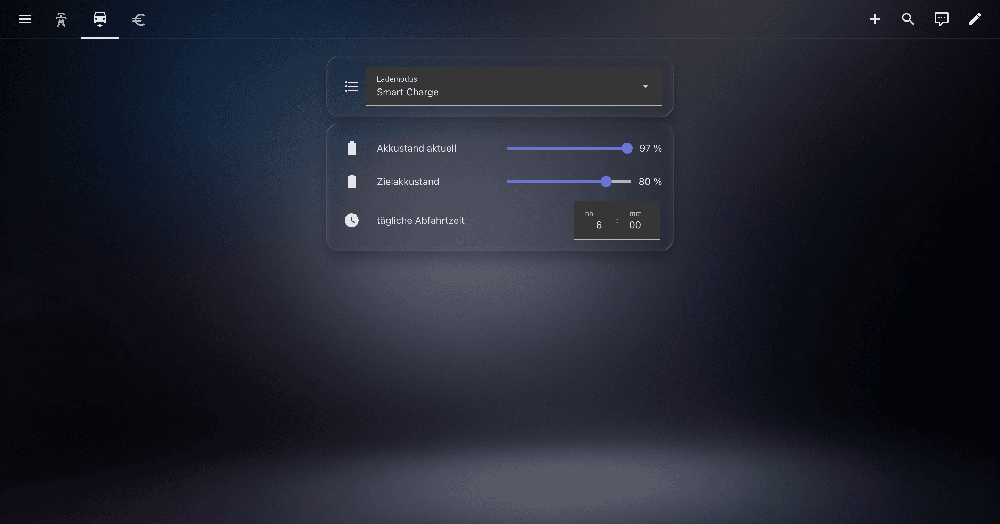

# Example Dashboard

This directory contains an example Home Assistant dashboard for the 1KOMMA5° integration.

## Frontend dependencies

Most cards use native Home Assistant card types. The dashboard additionally requires two custom cards (both available via HACS → Frontend):

| Custom card | Used for | HACS link |
|-------------|----------|-----------|
| [`apexcharts-card`](https://github.com/RomRider/apexcharts-card) | Strompreisentwicklung — 30 h price-forecast bar chart with colour tiers | search "apexcharts-card" |
| [`button-card`](https://github.com/custom-cards/button-card) | Time-range switcher (Tag / Woche / Monat / Jahr) on the cost chart | search "button-card" |

Without those cards installed the corresponding sections render as `Custom element doesn't exist` errors; the rest of the dashboard still works.

## Required Home Assistant helpers

The cost view's time-range switcher reads from an `input_select` helper. Create it once via **Settings → Devices & Services → Helpers → Create helper → Dropdown**:

| Property | Value |
|----------|-------|
| Name | `Stromkosten Zeitspanne` |
| Icon | `mdi:calendar` (any) |
| Options | `Täglich`, `Wöchentlich`, `Monatlich`, `Jährlich` |

The helper's `entity_id` must end up as `input_select.stromkosten_zeitspanne`. After creating it, set its initial state (e.g. to `Täglich`) so the chart renders on first load.

## Views

### Netz (Energieverbrauch und -erzeugung)


The main view is split into two columns and covers:

| Section | Cards |
|---------|-------|
| Netz- und PV-Leistung | Gauges for grid power (bidirectional, colour-coded), PV generation, battery charge/discharge and battery state of charge |
| Verbrauch | Total consumption gauge plus individual gauges for household, heat pump, wallbox and AC |
| Energiebezug und -einspeisung — täglich | 7-day bar chart (daily delta) for PV energy, grid import and grid export; today's totals as statistic cards |
| Energieverbrauch — täglich | 7-day bar chart (daily delta) for total, household, EV and heat pump energy; today's totals as statistic cards |
| Energiebezug und -einspeisung — monatlich | 6-month bar chart (monthly delta); current-month totals as statistic cards |
| Leistungs- und Einspeisungsverlauf (24h) | Full-width line chart of grid power, battery power, PV power and total consumption over the last 24 hours, sampled every 5 min |
| Energieverbrauch — monatlich | 6-month bar chart for consumption per device class; current-month totals as statistic cards |

The view header shows four **badges**: EMS auto mode switch, self-sufficiency ratio, the `Günstiger Strom` binary sensor and the current electricity price.

### EV (Electric Vehicle)



A focused view for controlling the EV charger, showing:

- Charging mode selector (Smart Charge / Quick Charge / Solar Charge)
- Manual battery level input, target battery level and daily departure time (visible in Smart Charge mode only)

### Preise und Kosten


An overview of dynamic electricity prices and accumulated costs, split into four sections:

| Section | Cards |
|---------|-------|
| Dynamische Strompreise | Cheapest future hour and price; line graphs for current, average, lowest and highest electricity price |
| Strompreisentwicklung | 30 h price-forecast bar chart with colour tiers (green / orange / red), powered by `apexcharts-card` |
| Stromkosten / Einspeisung | Accumulated electricity cost and feed-in revenue as statistic cards for today, this month and this year |
| Stromkosten & Einspeisevergütung (switcher) | `button-card` row to switch between Tag / Woche / Monat / Jahr; below it a `statistics-graph` that follows the selected range |

## Usage

1. In Home Assistant go to **Settings → Dashboards → Add Dashboard** (or open an existing one in edit mode)
2. Click the ⋮ menu → **Edit Dashboard** → **Raw configuration editor**
3. Paste the content of [`dashboard.yaml`](dashboard.yaml)
4. Replace the two placeholders throughout the YAML:

| Placeholder | Replace with | Where to find it |
|-------------|-------------|-----------------|
| `SYSTEM_NAME` | Your system name prefix | **Settings → Devices & Services → 1KOMMA5°**, visible on any entity ID |
| `CAR_IDENTIFIER` | Your EV entity prefix | Same location, visible on EV charger entities (e.g. `volkswagen_id_4`) |

5. Make sure the two custom cards (`apexcharts-card`, `button-card`) and the `input_select.stromkosten_zeitspanne` helper from the sections above exist.

### Template sensors for cheapest hour & price

The `cheapest_future_hour` and `cheapest_future_price` entities used in the price section are template sensors that read from the `Aktueller Strompreis` attributes. Add the following to your `configuration.yaml` (or a dedicated template file):

```yaml
template:
  - sensor:
      - name: "Cheapest future hour"
        unique_id: cheapest_future_hour
        icon: mdi:clock-outline
        availability: >
          {{ state_attr('sensor.SYSTEM_NAME_aktueller_strompreis', 'cheapest_future_hour') is not none }}
        state: >
          {{ state_attr('sensor.SYSTEM_NAME_aktueller_strompreis', 'cheapest_future_hour')
            | as_datetime | as_timestamp | timestamp_custom('%d.%m. %H:%M') }}

      - name: "Cheapest future price"
        unique_id: cheapest_future_price
        icon: mdi:currency-eur
        unit_of_measurement: EUR/kWh
        availability: >
          {{ state_attr('sensor.SYSTEM_NAME_aktueller_strompreis', 'cheapest_future_price') is not none }}
        state: >
          {{ state_attr('sensor.SYSTEM_NAME_aktueller_strompreis', 'cheapest_future_price')
            | round(4) }}
```

Replace `SYSTEM_NAME` with your system name prefix, then restart Home Assistant.
