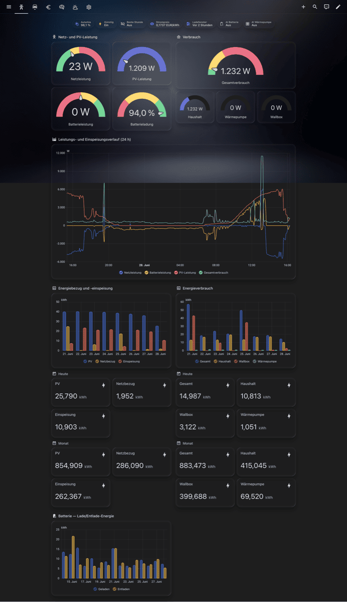
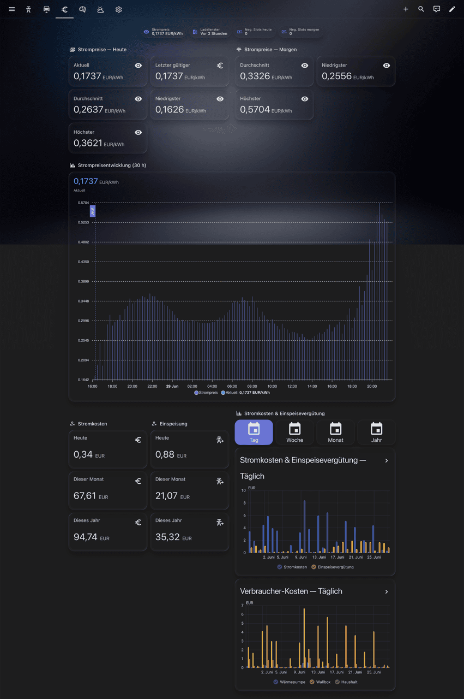
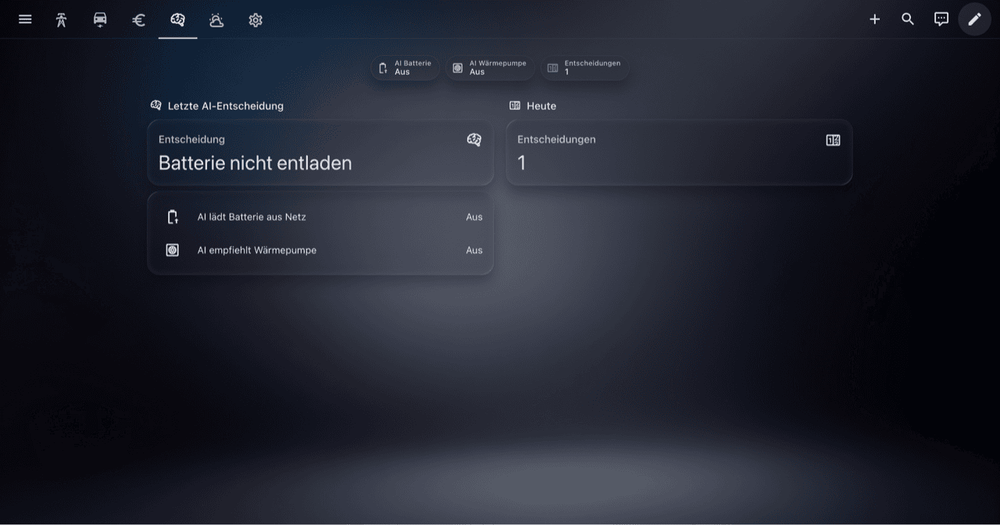
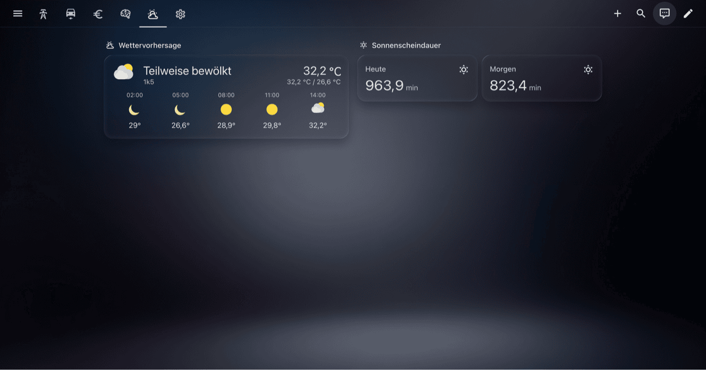
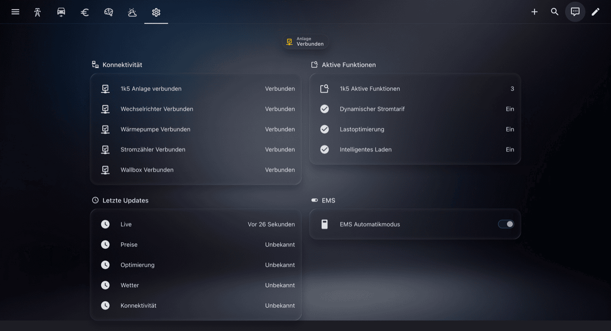

# Example Dashboards

This directory contains two example Home Assistant dashboards for the 1KOMMA5° integration. Both YAMLs are intentionally kept in German (the integration's primary audience), but this README is fully in English.

| File | When to pick it |
|------|-----------------|
| [`dashboard.yaml`](dashboard.yaml) | **Compact original** — three views (Grid / EV / Prices & costs). Battle-tested layout used in production on the developer's own setup. |
| [`dashboard-showcase.yaml`](dashboard-showcase.yaml) | **Showcase** — six views that exercise the full integration surface (Grid / Vehicle / Prices & costs / Optimization / Weather / System). Use this if you want to see what's possible. |

Both files use the same placeholder convention (`SYSTEM_NAME` / `CAR_IDENTIFIER`), the same custom-card requirements, and the same `input_select` helper. Pick one, follow the steps below.

## Frontend dependencies

Most cards use native Home Assistant card types. The dashboard additionally requires two custom cards (both available via HACS → Frontend):

| Custom card | Used for | HACS link |
|-------------|----------|-----------|
| [`apexcharts-card`](https://github.com/RomRider/apexcharts-card) | Price-forecast section — 30-hour bar chart with colour tiers | search "apexcharts-card" |
| [`button-card`](https://github.com/custom-cards/button-card) | Time-range switcher (day / week / month / year) on the cost chart | search "button-card" |

Without those cards installed the corresponding sections render as `Custom element doesn't exist` errors; the rest of the dashboard still works.

## Required Home Assistant helpers

The cost view's time-range switcher reads from an `input_select` helper. Create it once via **Settings → Devices & Services → Helpers → Create helper → Dropdown**:

| Property | Value |
|----------|-------|
| Name | `Stromkosten Zeitspanne` |
| Icon | `mdi:calendar` (any) |
| Options | `Täglich`, `Wöchentlich`, `Monatlich`, `Jährlich` |

The option labels and the helper name are German on purpose because the dashboard YAML compares against these literal strings. The resulting `entity_id` must be `input_select.stromkosten_zeitspanne`. After creating it, set its initial state (for example to `Täglich`) so the chart renders on first load.

## Views

### Grid (energy use and generation)


The main view groups gauges, daily/monthly bar charts and a 24-hour line chart:

| Section | Cards |
|---------|-------|
| Grid and PV power | Gauges for grid power (bidirectional, colour-coded), PV generation, battery charge/discharge and battery state of charge |
| Consumption | Total consumption gauge plus individual gauges for household, heat pump, wallbox and AC |
| Daily grid import / export | 7-day bar chart (daily delta) for PV energy, grid import and grid export; today's totals as statistic cards |
| Daily consumption | 7-day bar chart (daily delta) for total, household, EV and heat pump energy; today's totals as statistic cards |
| Monthly grid import / export | 6-month bar chart (monthly delta); current-month totals as statistic cards |
| 24-hour power flow | Full-width line chart of grid power, battery power, PV power and total consumption over the last 24 hours, sampled every 5 min |
| Monthly consumption | 6-month bar chart for consumption per device class; current-month totals as statistic cards |

The view header shows four **badges**: EMS auto mode switch, self-sufficiency ratio, the `Cheap electricity` binary sensor and the current electricity price.

### EV (electric vehicle)


A focused view for controlling the EV charger:

- Charging mode selector (Smart Charge / Quick Charge / Solar Charge)
- Manual battery level input, target battery level and daily departure time (visible in Smart Charge mode only)

### Prices and costs


An overview of dynamic electricity prices and accumulated costs, split into four sections:

| Section | Cards |
|---------|-------|
| Dynamic electricity prices | Cheapest future hour and price; line graphs for current, average, lowest and highest electricity price |
| Price forecast | 30-hour price-forecast bar chart with colour tiers (green / orange / red), powered by `apexcharts-card` |
| Cost / feed-in totals | Accumulated electricity cost and feed-in revenue as statistic cards for today, this month and this year |
| Cost & feed-in (switcher) | `button-card` row to switch between day / week / month / year; below it a `statistics-graph` that follows the selected range |
| Per-consumer costs | Same switcher drives a second `statistics-graph` showing the four per-consumer cost sensors (heat pump / wallbox / household / AC) for the same range |

## The Showcase view

The Showcase variant (`dashboard-showcase.yaml`) adds three views on top of the original three. All six tabs (YAML tab titles in German — these are the labels you see in the dashboard):

| Grid (Netz) | Vehicle (Fahrzeug) | Prices & costs (Preise und Kosten) |
|-------------|--------------------|------------------------------------|
|  |  |  |

| Optimization (Optimierung) | Weather (Wetter) | System |
|----------------------------|------------------|--------|
|  |  |  |

The three new views beyond the original `dashboard.yaml`:

| Section | Cards |
|---------|-------|
| Optimization | Last AI decision (locale-aware enum since v0.1.45), today's decision count, AI battery / heat-pump recommendation binaries. Settlement-dependent sensors (cost savings / energy bought / energy sold) are stubbed as a commented-out block because the 1KOMMA5° backend never populates them today. |
| Weather | The `weather.SYSTEM_NAME` entity rendered as a full forecast card, plus the sunshine duration sensors for today and tomorrow. |
| System | Site + per-asset connectivity binaries, the three "active feature" binaries (dynamic tariff / time-of-use / smart charging), all five diagnostic update-timestamp sensors, and the EMS auto-mode switch (diagnostic-categorised since v0.1.46). |

In every existing view the Showcase adds badges (e.g. AI status, cheap-now indicator) and expanded sections (tomorrow's price extremes, negative-price slot counters, battery charge/discharge split). It also replaces the helper template sensors `cheapest_future_hour` / `cheapest_future_price` with `sensor.SYSTEM_NAME_gunstigstes_ladefenster_heute` (lock-in via `RestoreSensor` since v0.1.42 — no flickering on flat-price days).

## Usage

1. In Home Assistant go to **Settings → Dashboards → Add Dashboard** (or open an existing one in edit mode).
2. Click the ⋮ menu → **Edit Dashboard** → **Raw configuration editor**.
3. Paste the contents of [`dashboard.yaml`](dashboard.yaml) or [`dashboard-showcase.yaml`](dashboard-showcase.yaml).
4. Replace the two placeholders throughout the YAML:

   | Placeholder | Replace with | Where to find it |
   |-------------|-------------|-----------------|
   | `SYSTEM_NAME` | Your system name prefix | **Settings → Devices & Services → 1KOMMA5°**, visible on any entity ID |
   | `CAR_IDENTIFIER` | Your EV entity prefix | Same location, visible on EV charger entities (e.g. `volkswagen_id_4`) |

   If your 1KOMMA5° device is assigned to a Home Assistant *area*, HA may prefix new entity_ids with the area slug (e.g. `garage_SYSTEM_NAME_…`). Use whatever your install actually generates — Settings → Devices & Services → 1KOMMA5° → click an entity to see its ID.

5. Make sure the two custom cards (`apexcharts-card`, `button-card`) and the `input_select.stromkosten_zeitspanne` helper described above exist.
6. (Showcase only) The gauge `min` / `max` values default to a typical 6 kW PV / 7 kWh battery / 11 kW wallbox setup — tune them to your hardware. See the comment block at the top of `dashboard-showcase.yaml` for the full list.

### Template sensors for the cheapest hour and price

The `cheapest_future_hour` and `cheapest_future_price` entities used in the price section are template sensors that read from the current-electricity-price sensor's attributes. Add the following to your `configuration.yaml` (or a dedicated template file):

```yaml
template:
  - sensor:
      - name: "Cheapest future hour"
        unique_id: cheapest_future_hour
        icon: mdi:clock-outline
        availability: >
          {{ state_attr('sensor.SYSTEM_NAME_aktueller_strompreis', 'cheapest_future_hour') is not none }}
        state: >
          {{ state_attr('sensor.SYSTEM_NAME_aktueller_strompreis', 'cheapest_future_hour')
            | as_datetime | as_timestamp | timestamp_custom('%d.%m. %H:%M') }}

      - name: "Cheapest future price"
        unique_id: cheapest_future_price
        icon: mdi:currency-eur
        unit_of_measurement: EUR/kWh
        availability: >
          {{ state_attr('sensor.SYSTEM_NAME_aktueller_strompreis', 'cheapest_future_price') is not none }}
        state: >
          {{ state_attr('sensor.SYSTEM_NAME_aktueller_strompreis', 'cheapest_future_price')
            | round(4) }}
```

Replace `SYSTEM_NAME` with your system name prefix, then restart Home Assistant.
